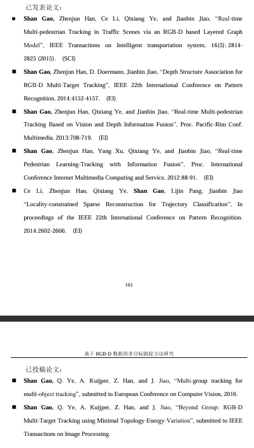
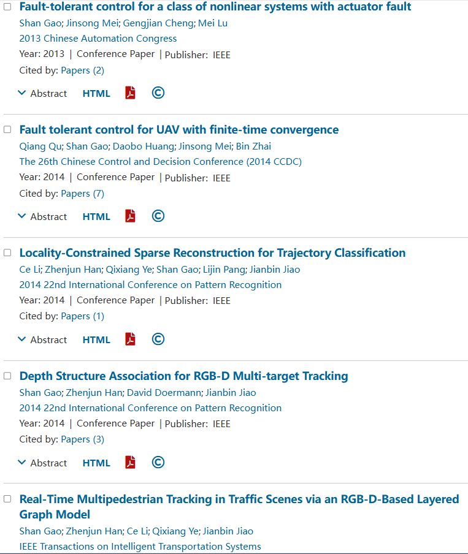
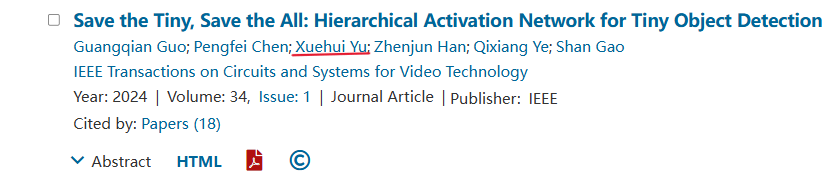

# Clear the Name of the high mountains
[中文版本](./README.md)

Waaaah, on Zhihu before, our beloved teacher Gao Shan actually accused me of cross-dressing. I sincerely defended the teacher, but Teacher Gao did a good job! It's just great that all the previous answers that mentioned him were deleted! It's not that I'm telling the truth and breaking down my defenses! What they said before was all lies!

The detestable article that slandered Teacher Gao Shan of the Unmanned Academy has been deleted. Does the author really hate the mentor who has taught you by word and deed for three years? He is simply a disgrace among students! Next, I will clear the name of Teacher Gao Shan. He is not the shameless and selfish bastard as some people say!

## Resume title verification

### Academic qualification clarification.

Xiaoheizi previously said that Teacher Gaoshan's master's degree was in logistics engineering, but the homepage stated that his master's and doctoral degrees were in Computer Application. This is academic fraud. Pah! You can look up the definition of the logistics engineering major. The training program for the logistics engineering major does involve the cultivation of courses related to computer information technology. If you learn computer courses in the training program, wouldn't that be a master's degree related to computer application technology? I'm very suspicious that the other party has ulterior motives for insisting on academic qualifications.

Teacher Gao's Homepage [1]

 Professor Gao's Master's Thesis [2]
Doctoral Academic Achievements [3]

Papers published during master's and doctoral studies [4]

There are also claims that Teacher Gao has engaged in academic misconduct, deliberately removing some authors and slandering them! It's definitely slander! Looking at the entire text, there are only two omissions. It's definitely not intentional. You see, Teacher Gao has corrected them later, right?

What? You said that you couldn't find Professor Gao's homepage in Google Scholar. That was for confidentiality, to prevent foreigners from discovering Professor Gao's latest research results and to stop them from plagiarizing ideas. Do you understand Professor Gao's good intentions? To say that Teacher Gao is not good at using a ladder to guide and has poor ability, only knowing how to change the title format, font size, parallelism, colons and question marks, etc., is slander! Isn't this a full exercise of students' independent research ability? If everything is done by Teacher Gao, then what are the students doing? You were recruited here to be a mascot. Don't you work hard to be worthy of the teacher's cultivation of you?

## Good conduct to clear one's name.

### Labor service clarification.

Some haters claim that they receive a minimum living allowance for their monthly labor service and cash it out if it's too high. It's truly a case of spreading rumors with just one mouth, but refuting them takes a lot of effort. Why don't you think about why Teacher Gao only pays so little? You are here to study, not to work. Why care so much about money? Besides, the school has already paid enough. Your workload doesn't even match that much labor fee. If you are short of money, you can tell Teacher Gao. Teacher Gao will add the corresponding workload and provide you with the corresponding labor. You can work hard on the project 24 hours a day and be available at any time. You can not only gain work experience but also receive a maximum of 3,000 yuan in labor. This is an experience you can't get from going to work.

As for cashing out, pah! How could that be called cashing out? That's the cost of Teacher Gao's frugality for his own family and everyone's hard work! It's quite reasonable to reimburse the transportation and accommodation fees for running back and forth between the two campuses for classes, isn't it? If you get tired of teaching students, it's quite reasonable to go out and relax and claim reimbursement for the travel expenses, isn't it? Managing the laboratory and guiding so many students is very tiring. Isn't it reasonable for the students to compensate the teachers with some labor? The more hardships you endure now, the stronger resilience you will have in society later on. Why don't you understand the teacher's good intentions?

### Clear the name of working hours

Some people say that Teacher Gao's laboratory schedule is 996. Isn't that spreading rumors? It is hereby declared that the evening is until ten o 'clock, not nine o 'clock. The laboratory is everyone's home. Since it's a home, it should be the place where you stay the longest. How could you want to rest at nine o 'clock? You should keep striving and working hard on scientific research. If you don't work hard, how can you produce results and publish papers? Otherwise, don't even think about graduating smoothly! What? You said the person next door goes to bed at 6 p.m.? Do what others do. Don't always compare yourself with others. If other research groups have money, the whole group can go on a trip. Although our research group also has money, we still need to carry forward the spirit of thrift and frugality. The money saved can be used as a bonus after publishing a paper, which can better motivate everyone to work hard on scientific research.

### Student academic clarification

Some people say that Teacher Gao guides undergraduate thesis herding. He gets the topic from the undergraduate school and then starts herding after getting it. Humph! This is simply throwing dirty water! A degree thesis should be a proof for students to independently complete scientific research. Since the aim is to cultivate students' research capabilities, the best strategy for supervisors is to adopt a hands-off approach as much as possible. The more supervisors help, the less students do on their own, which will indirectly lower the students' research level. There is no excuse for adding guilt. This must be the slander of some students with poor skills and questionable qualities!

Some people also say that Professor Gao's research group keeps changing directions. They simply don't understand Professor Gao's farsightedness. If you only focus on one research direction, how dull your research career would be! For people like us, we focus on one major direction for our undergraduate thesis, one major direction for our projects, and then another major direction for our master's thesis proposal. In the middle stage, we focus on a small direction. Only in this way can our graduation thesis work be full and fulfilling. Only in this way can innovation be sufficient. To say a lot but not a lot is to be jealous of Teacher Gao's ability.

Also, saying that the graduation process is blocked and that the signature approval is postponed until the last minute is also a false accusation. Teacher Gao is extremely busy every day. How could he have the time to deliberately hold people back? At most, he was too busy to notice. Could you just communicate more and it would be fine? Spreading rumors without words is nothing.

As for the claim that some students have delayed their graduation, it's pure slander! At Professor Gao's place, 90% of the students have been recommended for postgraduate studies. How could such outstanding students possibly delay their graduation? If they do delay their graduation, it's usually the students' own problem. It's because they haven't worked hard enough and their research capabilities are worrying. Most of them are just poor students who can't even get published in top journals. If a student doesn't work hard on the project and has poor stress resistance, only working six days a week and having two weeks off during winter and summer vacations, they can't handle it. They will be even worse off when they enter society. How can a student of such a level graduate smoothly? It's better not to quit!

### One's character sets a good example

Some people say that Teacher Gao is good at putting on a show. Isn't it just that after pulling in new students in the group, she posts about the research group dinner and badminton activities? Although the new students can't participate because they are not in Xi 'an, this is still a normal research group activity. I really don't know that some people's psychology is distorted like this. This can also be a conspiracy theory. Said it hasn't been sent since then? Who told you that the research group activities must be held multiple times a year? Once a year is not okay.

Some people also say that Teacher Gao is hypocritical. Before coming here, he was gentle and refined, but after becoming his student, he started to use Pua to retaliate. Not only do you not thank Teacher Gao for recruiting you as a postgraduate student, but you also repay kindness with enmity. You are simply not a son of man! It's just a few words of belittling you from time to time. This is a kind joke from the teacher, intended to inspire you to strive hard. Isn't it just belittling other students and teachers in front of you? This is just a joke played to protect the students' self-esteem. Isn't it just about publicizing what you said to him privately? This is a manifestation of a teacher's fairness and transparency, eliminating all unspoken rules! Isn't it just about finding faults with you a few more times? This is to make your output more perfect. To say that you are nitpicking is simply a defamation of the teacher! You should believe that all of this is for your own good.

They still say that when there is an advantage, they treat you as a distinguished guest, but when there is no advantage, they kick you away. They are selfish and self-serving. This was to help you adapt to the harshness of society in advance, but you were so kind as to be heartless. Just think about it, in society, who would open their hearts to you? Everyone is just calculating and exchanging benefits. This is a good opportunity for the teacher to train you in advance, so that you won't be sold and have to pay people back.

To say that the laboratory should be monitored is complete nonsense! It was torn down long ago! Instead of showing understanding of the teacher's hard work in supervising everyone's studies in the laboratory every day, they criticize the installation of surveillance cameras. What's wrong with installing the cameras because the teacher is too tired from supervising? All of this is done to maintain everyone's enthusiasm for learning! In the end, he forced the teacher to remove the camera. His heart is despicable!

Next, I will introduce the greatest strength of Teacher Gao, which is that she never speaks dirty words! Never hit or scold students! This is enough to show how noble Teacher Gao's professional ethics are! What a noble and upright character!

People act while heaven watches. If you dare to slander your teacher today, you will dare to betray the organization tomorrow. Things like "There was no choice before, but now I want to be a good person" are not reasons for you to make a glorious comeback after cutting ties! We must resolutely crack down on such people and foil their plots! Teacher Gao will always be our role model!

Finally, everyone is welcome to follow Teacher Gao's Xiaohongshu account. The previous content was blocked due to the slander of the haters. However, after the severe crackdown, maybe Teacher Gao will continue to share her daily life and enrollment brochures in the future

## References.

[1] high teacher home page (https://teacher.nwpu.edu.cn/2018010158.html)

Master degree theses of master of [2] (http://lamp.ucas.ac.cn/downloads/thesis/2013GaoShan.pdf)

PhD thesis [3] (http://lamp.ucas.ac.cn/downloads/thesis/2016GaoShan.pdf)

[4] The IEEE author information (https://ieeexplore.ieee.org/author/37085401079?searchWithin=%22Author%20Ids%22:37085401079&history=no&highlight =true&returnFacets=ALL&returnType=SEARCH&sortType=oldest)

[5] the little red book page (https://www.xiaohongshu.com/user/profile/5ef37842000000000101cbeb?tab=note&subTab=note)

 