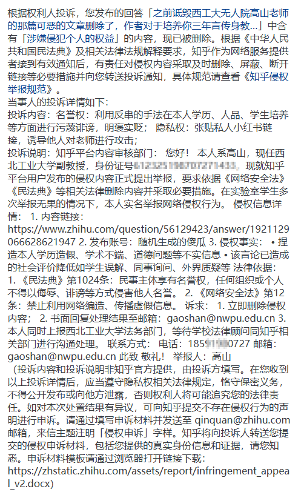
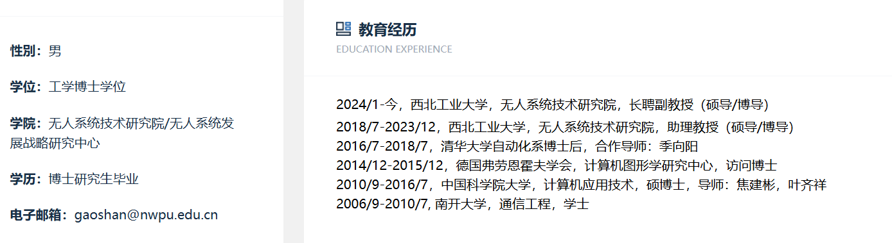
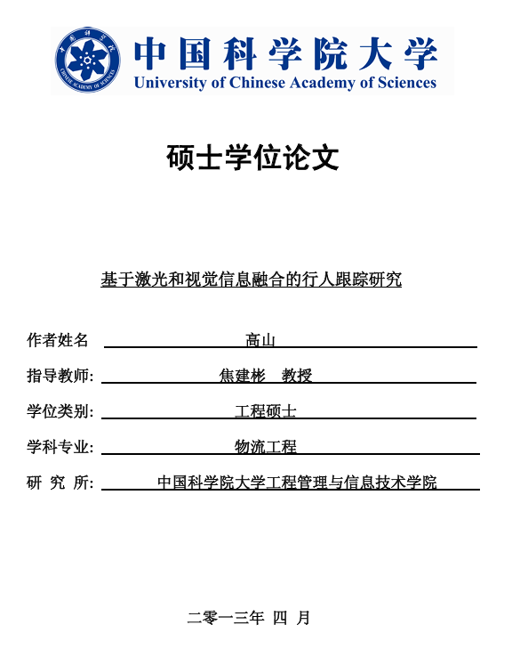
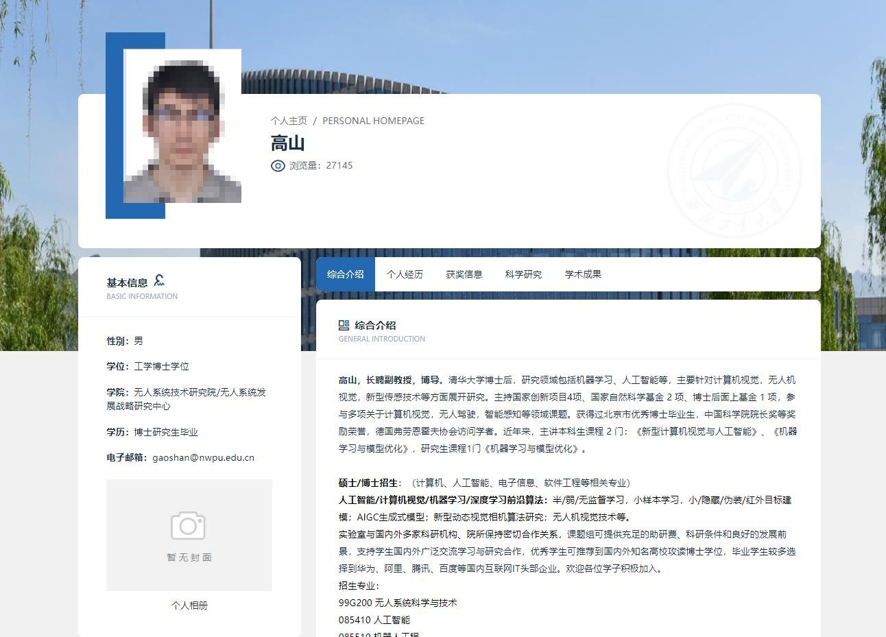
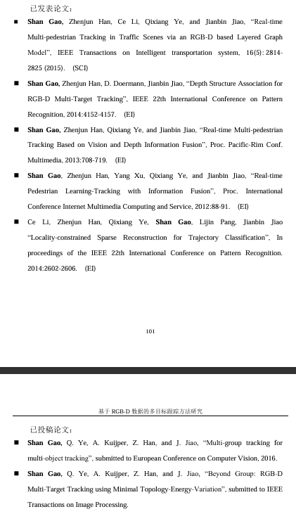
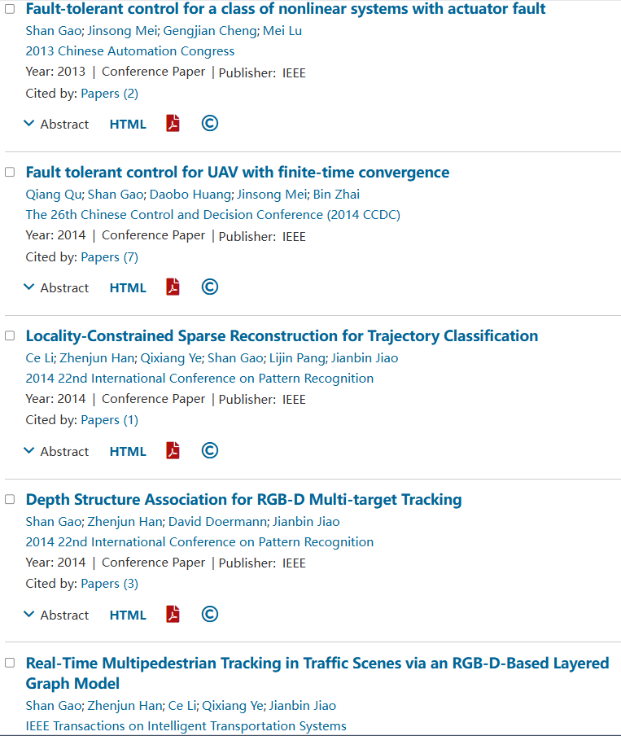
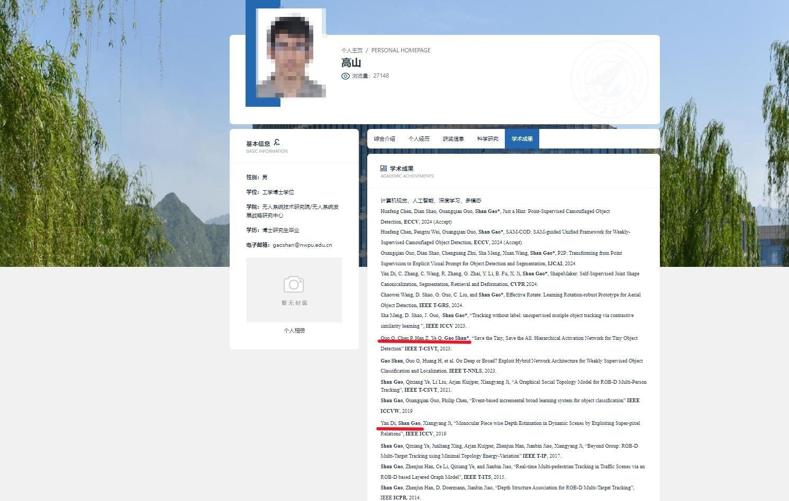
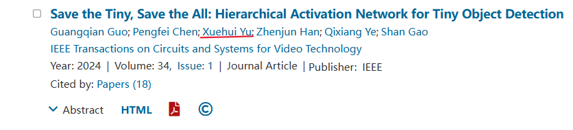

# 为高山正名
[English Version](./README-EN.md)

呜呜呜，之前在知乎上，我们敬爱的高山老师居然指责我反串，我可是真心实意为老师辩护的，不过高老师做的好！之前但凡提到他的回答都被删掉了，真是太棒了！才不是说真话破防了呢！之前他们说的都是假话！

接下来我将为高山老师正名，他并不是某些人口中无耻自私的混蛋！
## 简历正名
### 学历正名
小黑子之前说高山老师的硕士是物流工程，结果主页写的硕博是计算机计算机应用，这是学历欺诈。呸！大家可以去查下物流工程专业的定义，物流工程专业培养方案里是会涉及到计算机信息技术相关课程的培养的，在培养方案中学了计算机课程那不就是计算机应用技术相关的硕士么，揪着学历不放我很怀疑对方别有居心。

高老师主页[1]

高老师硕士论文[2]

### 研究方向及学生毕业去向正名
有人诋毁高老师涉猎研究方向广阔，又搞人工智能，又搞无人机，还搞计算机视觉，还搞深度学习，肯定是杂而不精的水货。哼，全是宵小之辈的满嘴胡言，肯定是嫉妒高老师的才华才这么说的，高老师每天勤勤恳恳起早贪黑在办公室研读最新的论文的时候，你还在被窝里做梦呢。

之前有人还说毕业生去向是和高老师同届的中科院的同门去向，不是自己副教授学生的毕业去向。怎么，这也是毕业去向啊，这不更能说明高老师是一表人才么，至于自己学生，肯定是为了保护学生隐私所以没写，你们不要乱黑。

### 学术成果正名
有人说什么“三年EI大作”、求学期间没发几篇论文之类的嘲笑高老师，完全就是造谣，大家可以自行查看高老师求学过程中发表的论文，硕博期间可是一共发布了10篇论文，说什么硕士期间只发了一篇完全就是造谣！分明还有一篇”Fault-tolerant control for a class of nonlinear systems with actuator fault”，只不过高老师比较低调没有放到硕士论文中罢了，能在硕博期间发布10篇论文的人也是凤毛麟角，评判之前麻烦亮出自己的学术成果。

博士学术成果[3]

硕博期间发表论文[4]

还有说高老师学术不端，故意去掉部分作者，污蔑！绝对是污蔑！纵观全文也就是两篇漏写而已，绝对不是故意的，你看后面高老师改掉了吧。

 

 
什么？你说Google Scholar中没查到高老师主页，那是为了保密，不让国外的洋人发现高老师的最新研究成果，防止他们剽窃创意，懂不懂高老师的良苦用心啊。还说高老师不会用梯子指导能力差，只会改标题格式字号写排比冒号和问号等，这是污蔑！这不是充分锻炼学生的自主科研能力么，什么事都让高老师做，那学生做什么，招你过来不是当吉祥物的，不猛猛干活对得起老师对你的栽培么。
## 品行正名
### 劳务正名
有黑子说每月劳务吃低保，高了就套现。真就是造谣一张嘴，辟谣跑断腿。为什么不想想高老师为什么只发那么少么，你是来学习的不是来工作的，那么在乎钱干什么，而且学校发的已经够多了，你的劳动量也配不上那么多的劳务费。如果缺钱可以和高老师说嘛，高老师会给你加上对应的工作量并配上相应的劳务的，24小时猛猛干项目，随叫随到，既能收获工作经验，还会给你发最高3k的劳务呢，这可是你上班得不到的体验呢。

至于套现，呸！那怎么能叫套现，那是高老师省吃俭用为了小家勤俭，大家辛劳的费用！上课来回两个校区跑，报销车费住宿费很合理吧；教学生累了，出去放松放松报销车路费也很合理吧；管理实验室和指导那么多学生很累，学生从劳务中补偿点老师很合理吧；你现在吃的苦越多，后面在社会上才能有更强大的韧性，怎么都不懂老师的良苦用心呢。
### 工作时间正名
有人说高老师实验室作息是996，这不是造谣么！特此声明，晚上是到十点不是九点。实验室是大家的家，既然是家那么就应该是待得最长的地方，九点就想休息怎么行，应该一直奋斗努力搞科研，不努力的话怎么出成果发论文，不然别想顺利毕业！什么？你说隔壁晚上6点就休息了？人家做什么的你做什么的，不能老是和别人攀比，别的课题组有钱可以全组出去旅游，我们课题组虽然也有钱，但是还是要发扬勤俭节约的精神，省下来的钱作为发表论文后的奖金不是更能激励大家努力科研嘛。
### 学生学业正名
有人说高老师指导本科论文放羊，从本科学校要过来题目，要过来后就放羊。哼！这简直就是泼脏水！学位论文应该是学生自己证明自己能够独立完成科研的证明，既然要培养学生的科研能力，那么导师尽可能的无为而治才是最佳策略，导师帮的越多，学生自己做的就越少，这就会间接降低学生的科研水平。欲加之罪何患无辞，这肯定是一部分水平低劣，素质堪忧的学生的污蔑！

还有人说高老师的课题组方向反复横跳，简直是不懂高老师的高瞻远瞩，只做一个方向的研究，那你的科研生涯该多枯燥啊，像我们这种本科毕设做一个大方向，项目做一个大方向，硕士开题再做另一个大方向，中期一个小方向，毕业论文的工作才会饱满，创新性才会充足啊。说杂而不精就是嫉妒高老师的能力。

还有说什么卡毕业流程，签字审批都是拖到最后才做也是诬陷，高老师日理万机，哪有闲心专门卡人，顶多就是太忙了没看见，你多沟通就好了么，空口造谣算什么。 

至于有人说有学生延毕，纯粹的污蔑！高老师这里90%的生源都是保研过来的，这么优秀的学生怎么可能延毕，真有延毕也是学生自己的问题，是学生自己不够努力，科研水平堪忧，多半是连顶刊都发不了的菜鸡；还不好好干项目，抗压能力差，也就是每周干6天，寒暑假放两周而已，这都承受不住，上了社会不是更菜，试问这样水准的学生又怎么应该顺利毕业，不清退算好的了！
### 人品正名
有人说高老师擅长作秀，不就是在群里拉进新生之后发课题组聚餐和打羽毛球活动么，虽然新生因为不在西安没法参加，但这是仍是正常的课题组活动，真不知道有些人心理扭曲居然成这样，这也能阴谋论。说之后再也没发过？谁和你说课题组活动必须一年多次，一年一次不行么。

还有人说高老师虚伪的，来之前温文尔雅，成了他的学生之后就开始Pua打击报复。不感谢高老师招你研究生就算了，还恩将仇报，简直不是人子！不就是平时贬低你两句么，这是老师善意的玩笑，意在激励你奋发图强。不就是在你面前贬低其他学生和老师么，这只是为了维护学生的自尊心所开的玩笑。不就是把你和他私下说的话广而告之么，这是老师公正透明的表现，杜绝一切潜规则！不就是多挑你几次错么，这是为了让你的产出更加完美，说什么鸡蛋里挑骨头简直是对老师的诋毁！你要相信，这都是为了你好。

还说什么有利时奉若上宾，没利时一脚踹开，自私自利。这是为了让你提前适应社会险恶，你却好心当驴肝肺。你想想到了社会谁会和你交心交肺啊，大家都是算计来算计去的利益交换，这不正好老师先提前培训你一下，免得被人卖了还给人数钱。
还说实验室安监控，完全就是胡扯！早就拆掉了！不体谅体谅老师每天实验室监督大家学习的辛劳，反而指责安监控，老师监督太累安摄像头怎么了，都是为了大家保持学习热情才这么做的！搞到最后迫使老师拆除摄像头，其心可诛！
接下来我将介绍高老师最大的优点，那就是不-说-脏-话！从来不会打骂学生！这足以看出高老师的师德是多么的高尚！多么的高风亮节！

人在做，天在看，今天你敢诋毁老师，明天就敢背叛组织。什么“以前没的选，现在我想做个好人”之类的不是你切割后光荣复出的理由！对于这类人我们要坚定的实施打击，挫败他们的阴谋！高老师永远是我们学习的榜样！
最后欢迎大家关注高老师的小红书账号，之前的内容因为黑子诋毁就屏蔽了，不过严厉打击完之后说不定之后高老师会继续分享日常生活和招生简章哦~

## 参考文献
[1] 高老师主页(https://teacher.nwpu.edu.cn/2018010158.html)

[2] 硕士学位论文(http://lamp.ucas.ac.cn/downloads/thesis/2013GaoShan.pdf)

[3] 博士学位论文(http://lamp.ucas.ac.cn/downloads/thesis/2016GaoShan.pdf) 

[4] IEEE作者信息(https://ieeexplore.ieee.org/author/37085401079?searchWithin=%22Author%20Ids%22:37085401079&history=no&highlight=true&returnFacets=ALL&returnType=SEARCH&sortType=oldest)

[5] 小红书主页(https://www.xiaohongshu.com/user/profile/5ef37842000000000101cbeb?tab=note&subTab=note)

